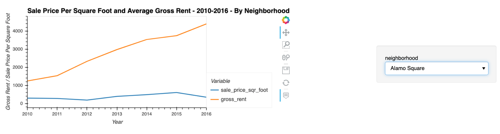
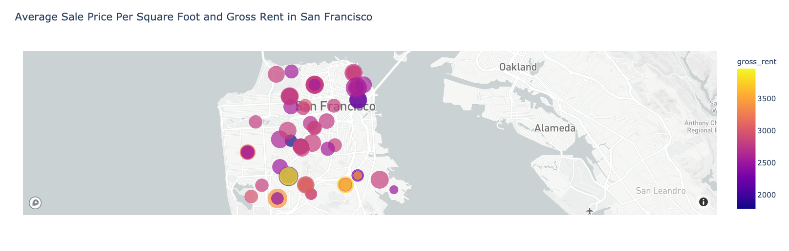

# Data Visualization in a Real Estate Market (San Francisco)

Analysis for a one-click service for people to buy properties and then rent them in San Francisco. Using data visualization, aggregation, interactive visualizations, and geospatial analysis, to find properties in the San Francisco market that are viable investment opportunities.






---

## Technologies

This project uses python 3.7 along with the following packages:

* [JupyterLab](https://jupyterlab.readthedocs.io/en/stable/) - Web based user interface for data analysis.

* [pandas](https://github.com/pandas-dev/pandas) - Data analysis and manipulation library.

* [dotenv](https://pypi.org/project/python-dotenv/) - Python-dotenv reads key-value pairs from a .env file and can set them as environment variables.

* [plotly.express](https://plotly.com/python/plotly-express/) - The plotly.express module contains functions that can create entire figures at once.

---

## Installation Guide

Please install the following before starting the application

```python
  pip install jupyterlab
  pip install pandas
  pip install dotenv
  pip install plotly.express
```
In case of issues, please see the requirements.txt for a complete list of packages with versions needed to run this application

For problems with the installation:
```python
  conda deactivate
  conda install ipykernel -y
  conda create -n pyvizenv python=3.7 -y
  conda activate pyvizenv
  conda install -c conda-forge jupyterlab=2 -y
  conda install -c plotly plotly=4.13. -y
  conda install -c pyviz hvplot -y
  conda install -c conda-forge nodejs=12 -y
  conda install streamz -y
  pip install python-dotenv decorator==4.3 networkx
  conda install nb_conda_kernels ipykernel -y
  jupyter labextension install jupyterlab-plotly@4.13.0 --no-build
  jupyter labextension install @jupyter-widgets/jupyterlab-manager plotlywidget@4.13.0 --no-build
  jupyter labextension install @pyviz/jupyterlab_pyviz --no-build
  conda list plotly
  conda list hvplot
  conda list nodejs
```
---

## Usage

To use the financial planning tools, please download and open the **san_francisco_housing.ipynb** in jupyter lab after executing
the following on the command line:

```python
jupyter lab
```
Jupytper Lab should open automatically in a browser. 
If it does not, please follow the instructions on the command line.

---

## Contributors

Sangram Singh (sangramsinghg@yahoo.com)

---

## License

MIT
